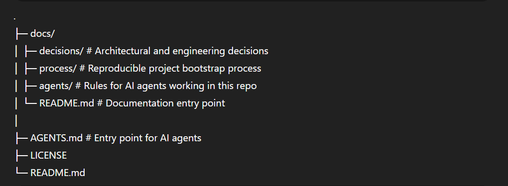

# Project Bootstrap Skeleton

I got tired of starting projects in chaos.

This repository is a **project bootstrap skeleton** — not a framework and not a starter kit.
It captures a **repeatable process** for starting new engineering projects with clarity,
explicit decisions, and room to evolve.

The goal is not to eliminate iteration, but to avoid accidental complexity
during the first days and weeks of a project.

---

## What this repository is

This is a **thinking and structure skeleton**, demonstrated through a real project:
a Kubernetes-based, monorepo job processing platform.

It focuses on:

- how decisions are made
- how they are documented
- how complexity is introduced incrementally
- how to start coding without locking yourself too early

---

## What this repository is NOT

- ❌ Not a production ready platform
- ❌ Not a boilerplate with batteries included
- ❌ Not a framework you must follow strictly

This is a **reference and starting point**, meant to be adapted.

---

## Why this exists

Most projects do not fail because of technology choices.
They struggle because early decisions are:

- implicit instead of explicit
- undocumented
- hard to change later

This skeleton is an attempt to:

- make early decisions visible
- separate _now_ vs _later_
- reduce the cost of change
- allow projects to evolve intentionally

---

## Repository structure

---

## Key concepts

### Decisions first

All important architectural and engineering decisions are documented before implementation.
See:

- `docs/decisions/`

### One-page summary

A single page that explains _what was decided and why_:

- `docs/decisions/100-architecture-decisions-one page.md`

### Reproducible process

A step by step playbook describing how this repository was created:

- `docs/process/PROJECT_BOOTSTRAP_PLAYBOOK.md`

### AI agents as team members

This repository treats AI agents as contributors with clear rules and boundaries:

- `AGENTS.md`
- `docs/agents/CANONICAL.md`

---

## Technology choices (demonstration project)

The example project in this repository uses:

- Kubernetes
- Monorepo with Nx
- TypeScript for API and workers
- Fastify for API
- Protocol Buffers for contracts
- GitOps delivery model
- Incremental observability and scalability

These choices are **documented**, not enforced.

---

## How to use this repository

You can use this repository in several ways:

1. **As a reference**
   Read the decisions and the playbook to improve how you start projects.

2. **As a skeleton**
   Fork or copy the structure and adapt it to your own project.

3. **As a discussion starter**
   Use it to align teams on how decisions are made and documented.

---

## When this approach helps most

- greenfield projects
- platform or infrastructure work
- projects expected to evolve over time
- teams that want clarity early without over-design

---

## When this approach may be too heavy

- very small throwaway scripts
- one-off experiments
- time-boxed spikes

This is intentional.

---

## License

MIT.  
Use it, adapt it, break it — just be explicit about your decisions.

---

## Final note

This repository will evolve.
If the process turns out to be wrong, the process itself will be updated.

That is the point.
